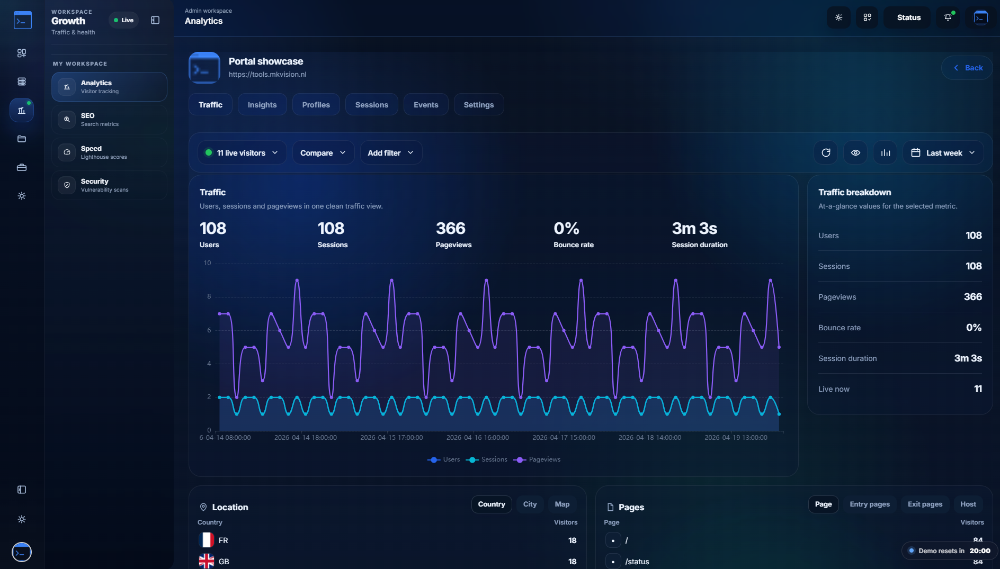
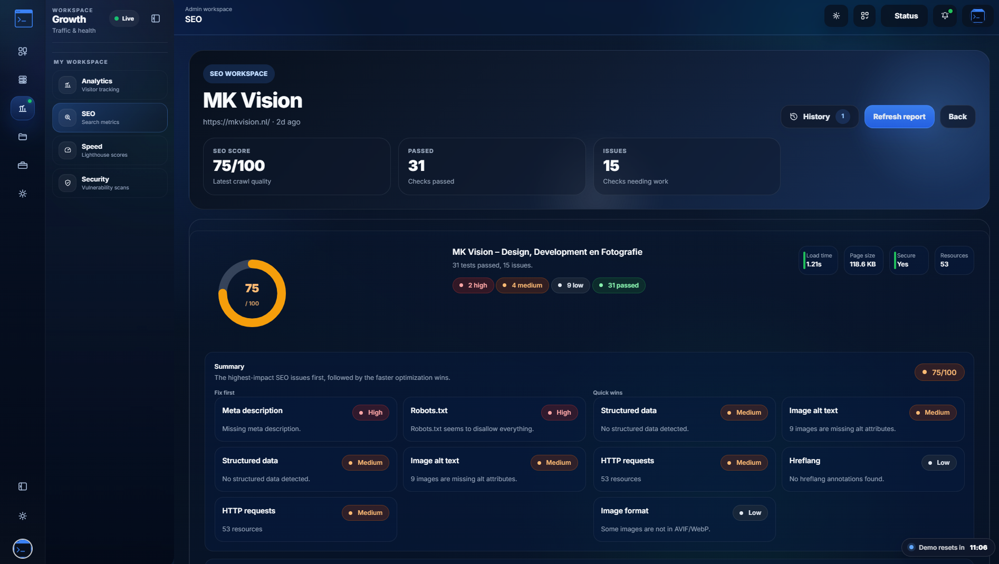
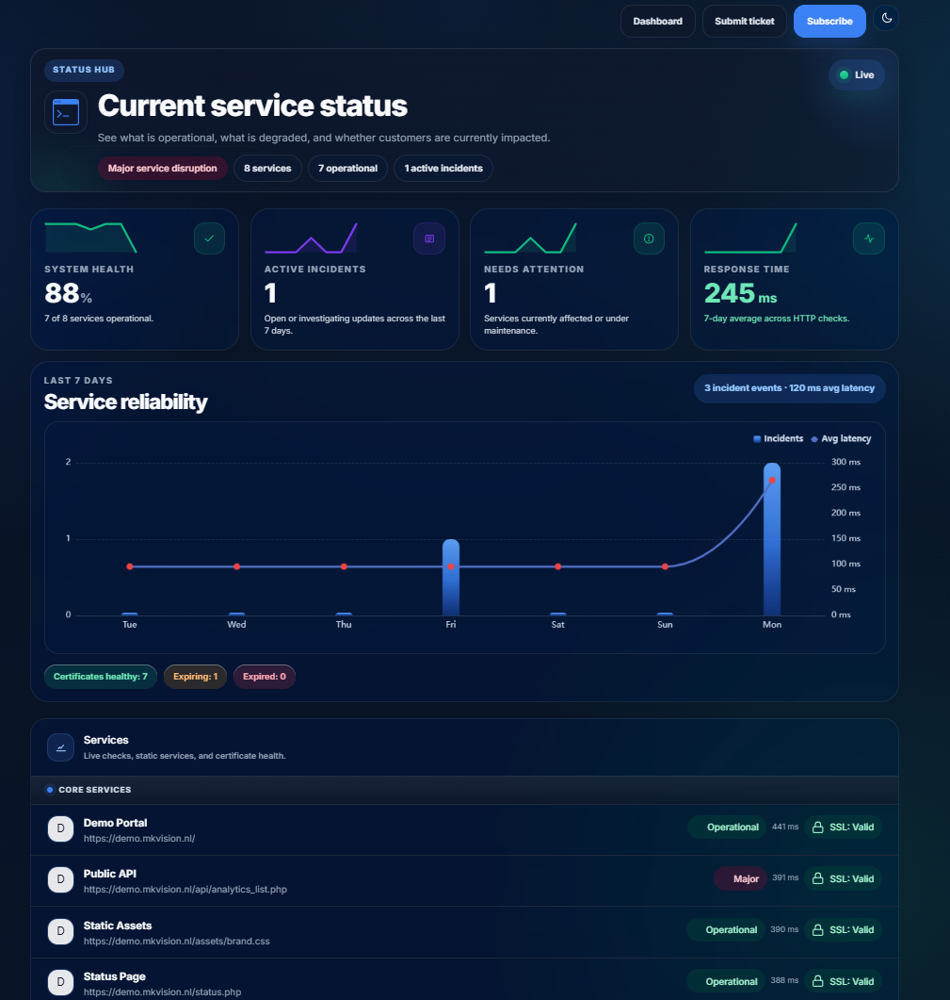
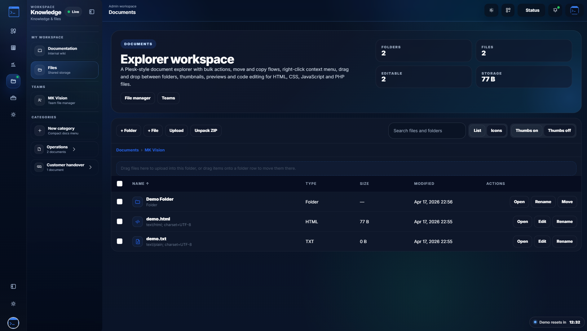
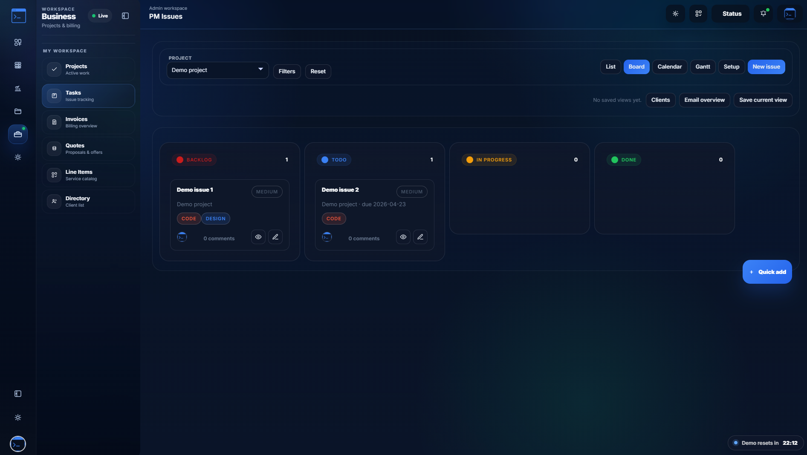
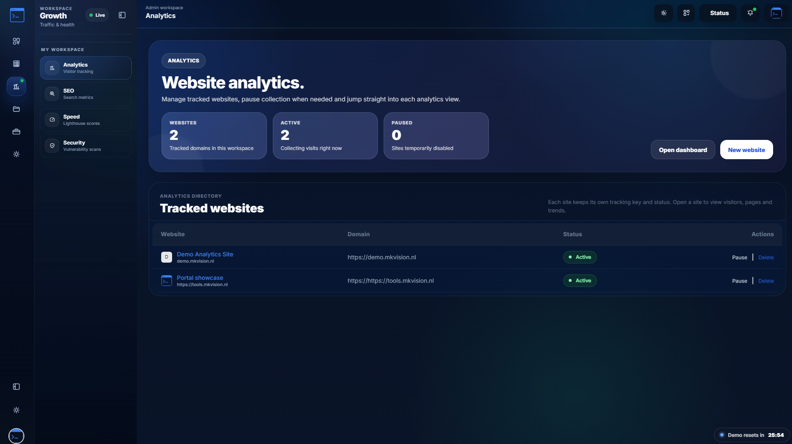

# mkvision-workspace
A complete business operations platform built in PHP — combining monitoring, analytics, SEO tools, financial workflows, project management, ticketing, and a dynamic status page in one powerful workspace.

# 🚀 MKVision Tools Portal

A powerful all-in-one PHP + MariaDB/MySQL platform combining **monitoring, analytics, SEO tools, financial workspace, team collaboration, and project management** into a single modern portal.

## 🌐 Live Demo

👉 https://tools.mkvision.nl

---

## ✨ Core Features

### 📊 Monitoring & Infrastructure

* Real-time uptime, health, and latency monitoring
* Multiple monitor types (HTTP, services, etc.)
* Historical data visualization (no dummy data)
* Intelligent status detection
* Integrated alerts & incident tracking

---

### ⚡ SEO & Performance Tools

* Google PageSpeed Insights (Mobile & Desktop)
* Full Lighthouse data integration
* Performance tracking over time
* SEO analysis tools
* API-based data collection

---

### 📈 Analytics Dashboard

* Centralized performance overview
* Traffic & performance insights (when integrated)
* Historical trends and comparisons
* Expandable analytics modules

---

### 🌐 Advanced Status Page

A fully featured, public-facing **status page system**.

**Key capabilities:**

* Real-time system health indicators
* Incident tracking and history
* Clean, modern UI
* Fully configurable components:

  * System health
  * Active incidents
  * Needs attention
  * Response time
  * Service reliability
  * Past incidents

**Smart layout:**

* Enabled cards automatically redistribute across the width
* Fully responsive and adaptive

---

### 💰 Financial Workspace

A complete financial environment for managing business operations.

**Offers / Quotes:**

* Create and manage professional offers
* Send offers to clients
* Support for:

  * ✅ Online signing
  * 📄 PDF export & signing
* Status tracking (draft, sent, signed, expired)

**Invoicing:**

* Generate invoices from offers or manually
* Track payment status
* Manage clients and billing data
* Export invoices as PDF

**Workflow:**

* Seamless flow: Offer → Approval → Invoice
* Centralized financial overview

---

### 🗂️ File Explorer (Team Files)

* Built-in file management system
* Upload, organize, and manage files
* Folder structure support
* Secure team access
* Ideal for internal collaboration

---

### 📋 Project Management

* Create and manage projects
* Track tasks and milestones
* Organize workflows per project
* Built for team collaboration
* Scalable for multiple teams

---

### 🎫 Ticketing Suite

* Internal helpdesk system
* Create, assign, and track tickets
* Status management (open, in progress, resolved)
* Conversation threads per ticket
* Suitable for internal and client support

---

### 👥 Team & Collaboration

* Multi-user environment
* Role-based access (extendable)
* Shared tools, files, and projects
* Central workspace for teams

---

### 🔐 Admin Panel

* Manage all modules centrally
* Configure system settings
* Control status page visibility
* Manage API keys (PageSpeed, etc.)
* System health overview

---

### 🎬 Modern UI/UX

* GSAP-powered animations
* Smooth transitions and interactions
* Clean and responsive design
* Optimized for usability

---

## ⚙️ Requirements

* PHP 8.1+
* MariaDB / MySQL
* cURL enabled
* Apache (with `.htaccess` support)
* Writable `.env` file

---

## 📦 Installation

1. Upload files to your server
2. Go to `/install`
3. Complete the installation wizard
4. Access `/admin`

---

## 🔑 Configuration

### Google PageSpeed API

* Navigate to **Admin → Settings**
* Add your API key
* Stored in:

  * Database (primary)
  * `.env` (fallback)

---

## 📁 Project Structure (simplified)

```bash id="pp0nqt"
/public
  /admin
  /api
  /assets
/app
/config
/storage
```

---

## ⚡ Performance Notes

* PageSpeed runs in parallel (Mobile + Desktop)
* Optimized request flow
* Real data only (no placeholders)

---

## ⚠️ Notes

* PageSpeed results depend on Google Lighthouse
* Some sites may return errors like `NO_FCP`
* Performance depends on external factors

---

## 📄 License

## License

This project is proprietary software.

You are not allowed to copy, modify, distribute, or use this software without explicit permission from MKVision.

For licensing inquiries:
https://tools.mkvision.nl

---

## 👨‍💻 Author

Developed by MKVision
https://tools.mkvision.nl


## 📸 Screenshots

### Dashboard & Analytics


### SEO & Performance


### Status Page


### File Explorer


### Project Management


### Infrastructure Monitoring

